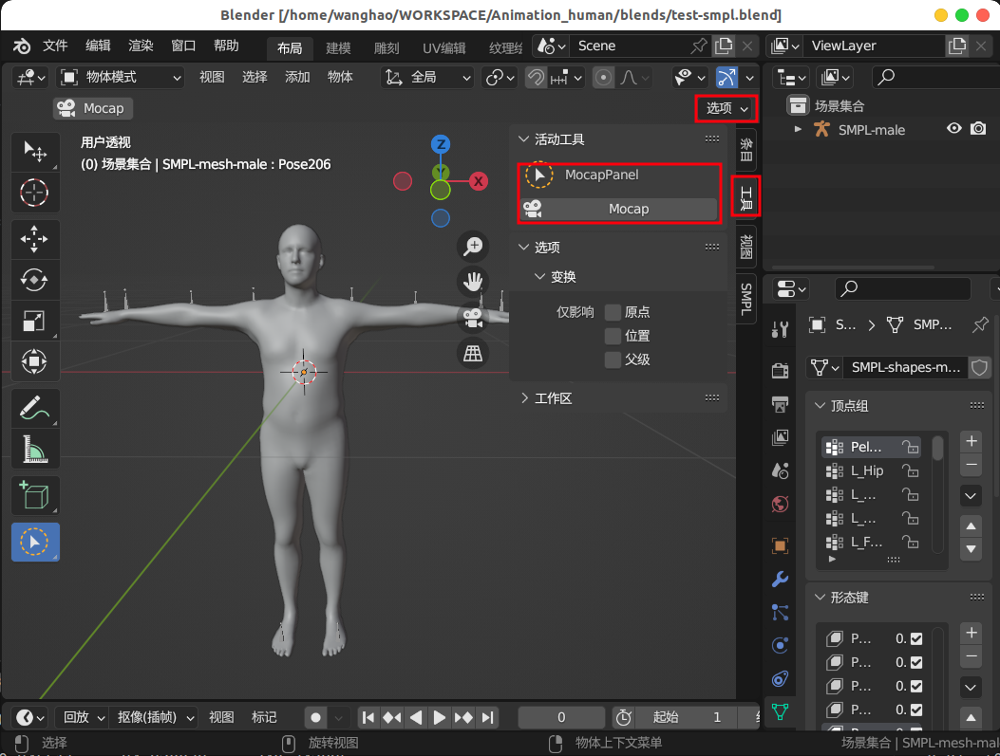
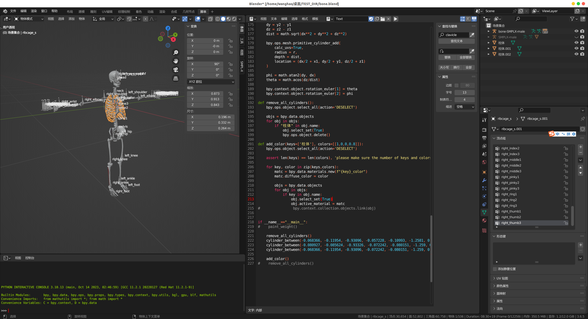

# Description

This project is used to drive a given model's animation using the output from IMU (Inertial Measurement Unit) devices. The project is still in progress...


# Requirements

This project requires downloading and installing Blender >= 3.0 (for reading assets and binding animation), as well as setting up Blender's Python environment with the dependencies listed in requirements.txt. Please add your characters in .blend format into blends directory.

# Run

Since I don't have an IMU device, I have used some publicly available datasets or data exported from MVN software (such as BVH, XLS, etc.). Therefore, it is necessary to start a process to simulate real-time data reception.

After executing the following command, Blender will open automatically. Click on the "Mocap" button, and Blender will prepare to receive motion data.

```
bash scripts/server_start.sh
```



Then execute the following command to start a process for simulating real-time data reception.

```
bash scripts/client_start.sh
```

The characters in Blender will animate according to the provided motion. You can change the character by replacing a different .blend file in the server_start.sh script, but please remember to modify the bone mapping in capture_poses.py accordingly.

Introduce a new smplx deformation mode for maintaining volume consistency during deformation.

## Scripts

The script in `tools/paint_weights.py` used for assign weights for all points in each vertex group. Please add your bone armature into an empty .blend file and run `blender path/to/xx.blend -P tools/paint_weights.py`.



# Acknowledge

Our code took reference from [Blender](https://github.com/blender/blender-addons/tree/main/io_anim_bvh), [live_mocap](https://github.com/EasternJournalist/live_mocap). We thank these authors for their great works and open-source contribution.
